# Architecture

This document describes the internal architecture of @lokiverse/bus.

## High-Level Overview

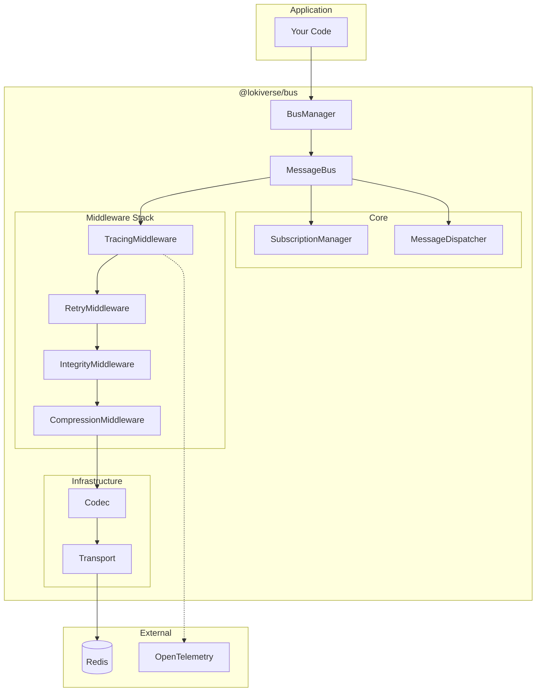

## Component Diagram

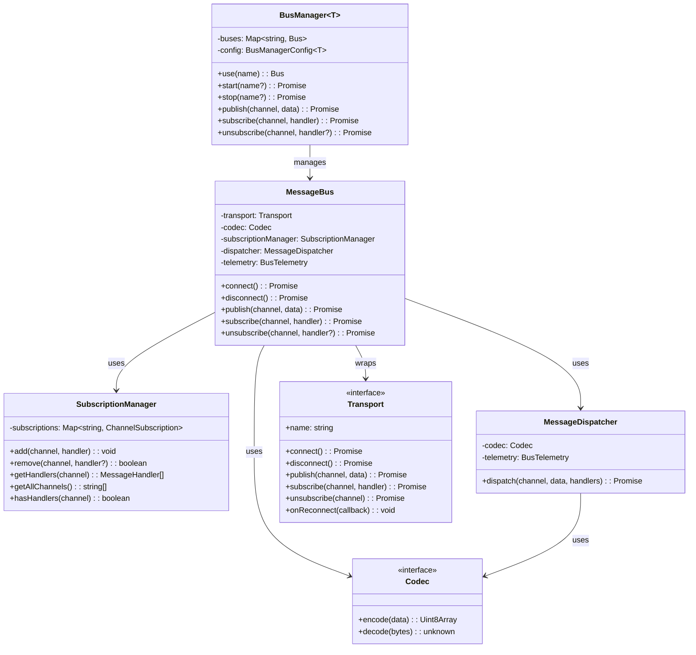

## Message Flow

### Publish Flow

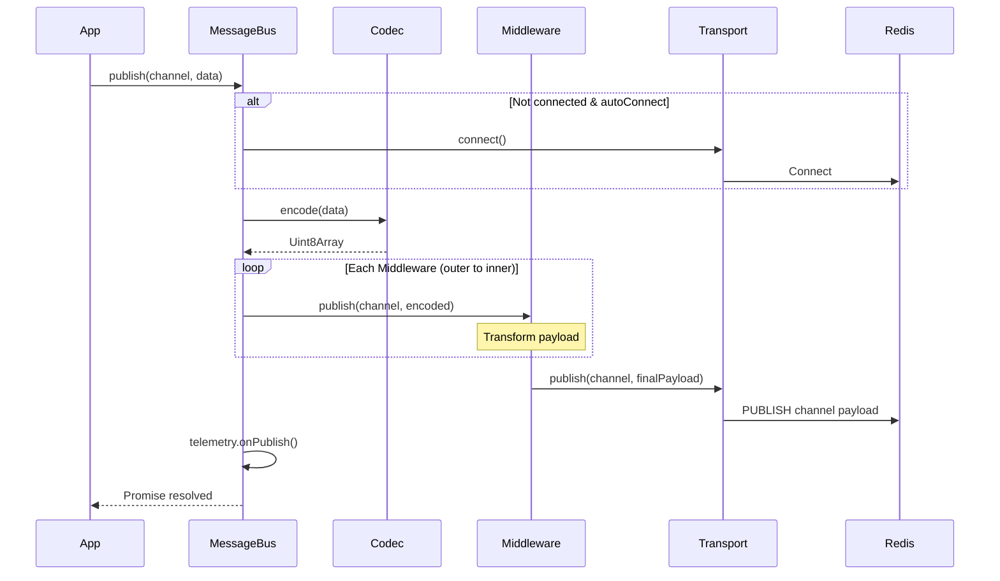

### Subscribe Flow

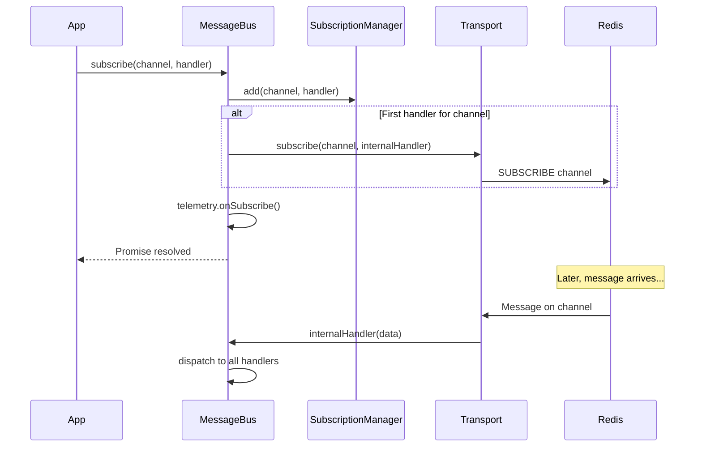

### Message Dispatch Flow

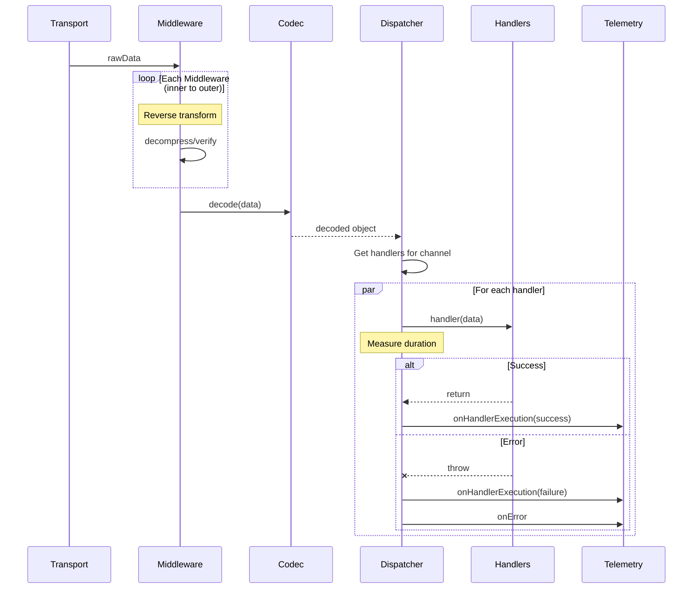

## Middleware Architecture

Middleware wraps the transport using the decorator pattern:

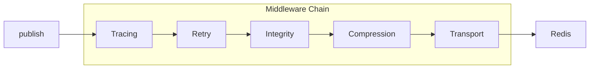

### Middleware Interface

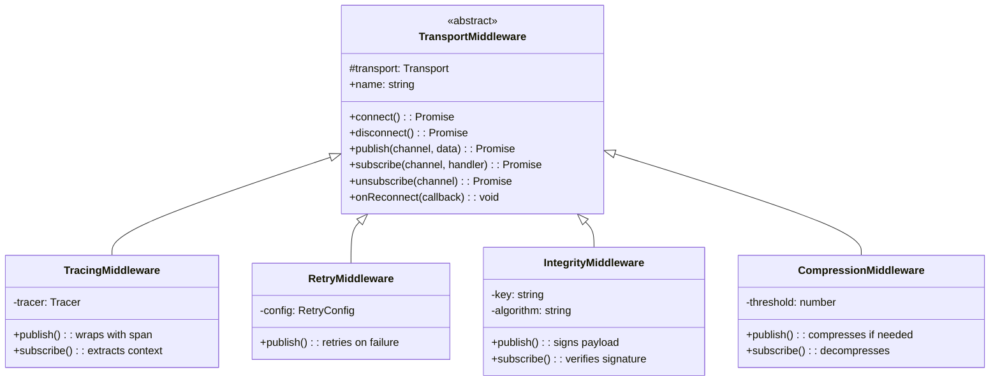

### Middleware Composition

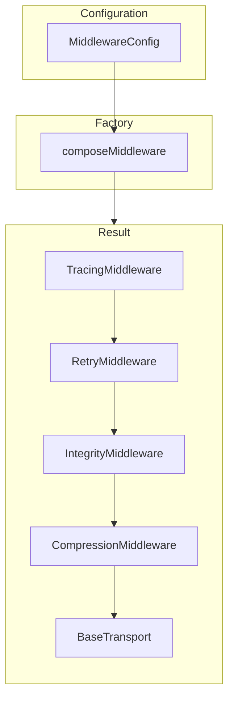

The middleware stack is built from configuration:

```typescript
// Input
middleware: {
  tracing: { tracer },
  retry: { maxAttempts: 3 },
  integrity: { type: 'hmac', key: 'secret' },
  compression: { type: 'gzip', threshold: 1024 }
}

// Creates chain:
// TracingMiddleware(
//   RetryMiddleware(
//     IntegrityMiddleware(
//       CompressionMiddleware(
//         RedisTransport
//       )
//     )
//   )
// )
```

## BusManager Architecture

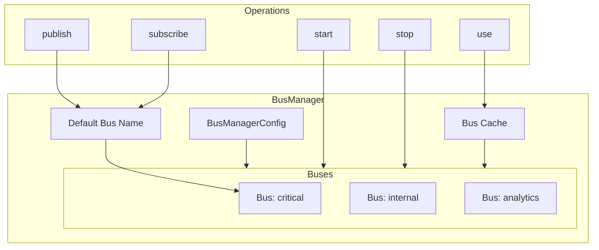

### Lazy Initialization

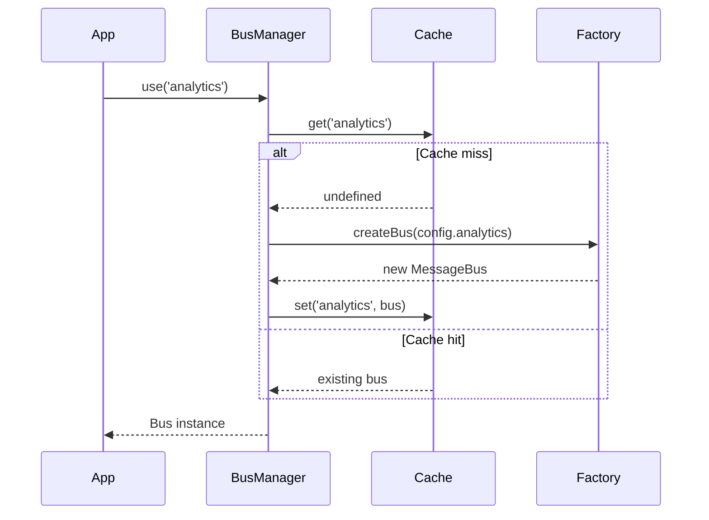

## Redis Transport Internals

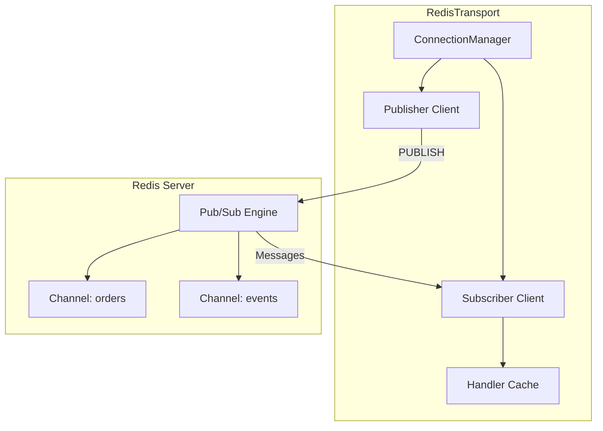

### Connection State Machine

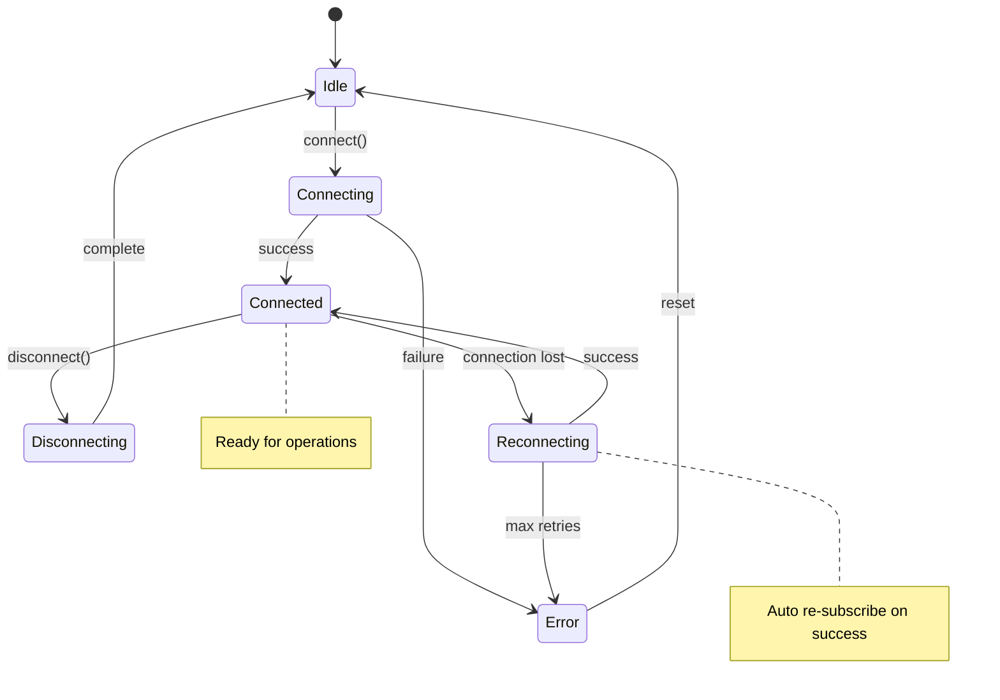

## Error Hierarchy

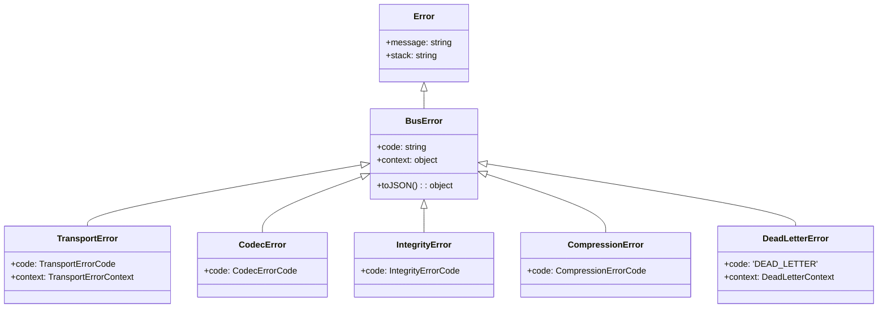

### Error Codes

| Error Class      | Codes                                                                                        |
| ---------------- | -------------------------------------------------------------------------------------------- |
| TransportError   | `CONNECTION_FAILED`, `NOT_READY`, `PUBLISH_FAILED`, `SUBSCRIBE_FAILED`, `UNSUBSCRIBE_FAILED` |
| CodecError       | `ENCODE_FAILED`, `DECODE_FAILED`, `PAYLOAD_TOO_LARGE`                                        |
| IntegrityError   | `VERIFICATION_FAILED`, `INVALID_FORMAT`                                                      |
| CompressionError | `COMPRESS_FAILED`, `DECOMPRESS_FAILED`                                                       |
| DeadLetterError  | `DEAD_LETTER`                                                                                |

## Data Flow Through Layers

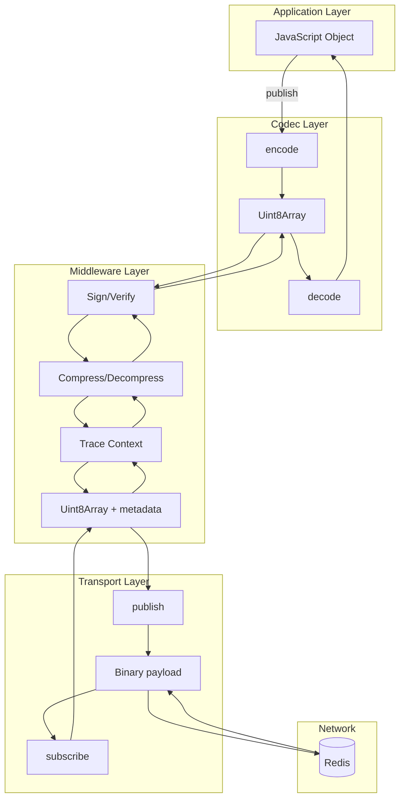

## Performance Characteristics

### Memory Usage

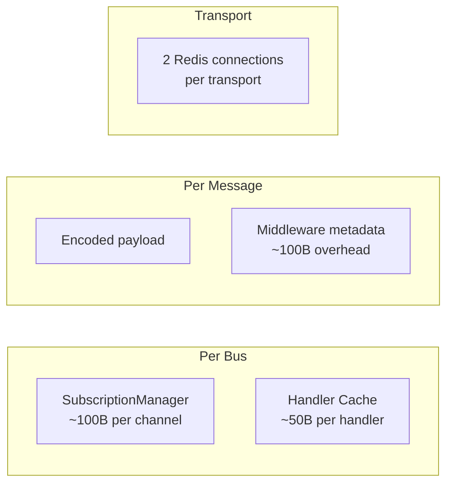

### Latency Breakdown

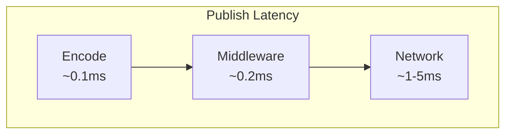

| Operation           | Typical Latency                |
| ------------------- | ------------------------------ |
| Codec encode/decode | 0.01-0.5ms                     |
| Compression (5KB)   | 0.1-0.5ms                      |
| HMAC sign/verify    | 0.01-0.05ms                    |
| Redis round-trip    | 1-5ms (local), 5-50ms (remote) |

## Thread Safety

The library is designed for single-threaded Node.js environments:

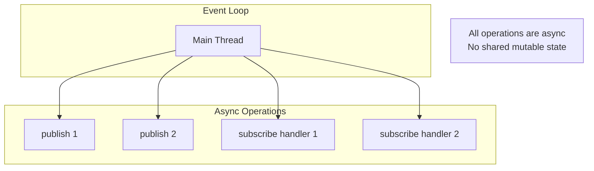

- All operations return Promises
- No shared mutable state between operations
- Handler execution uses `Promise.allSettled()` for isolation
- Telemetry callbacks are fire-and-forget (non-blocking)
