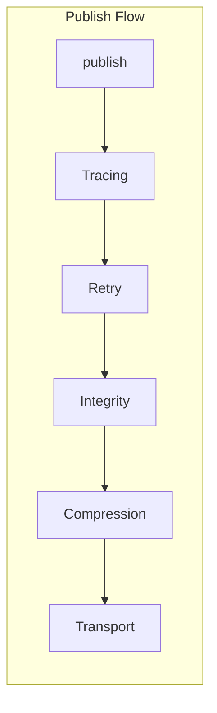
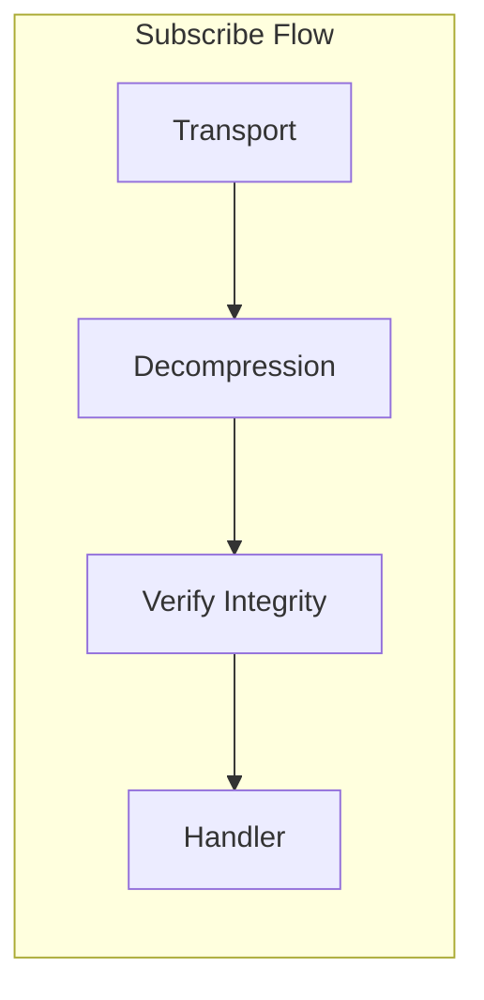
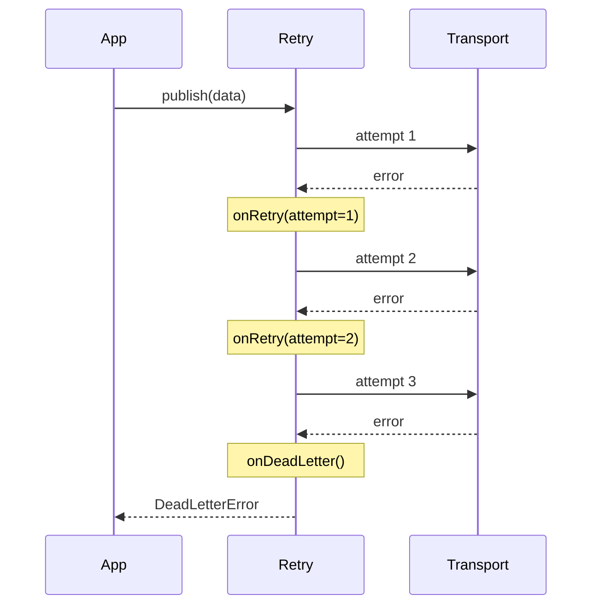
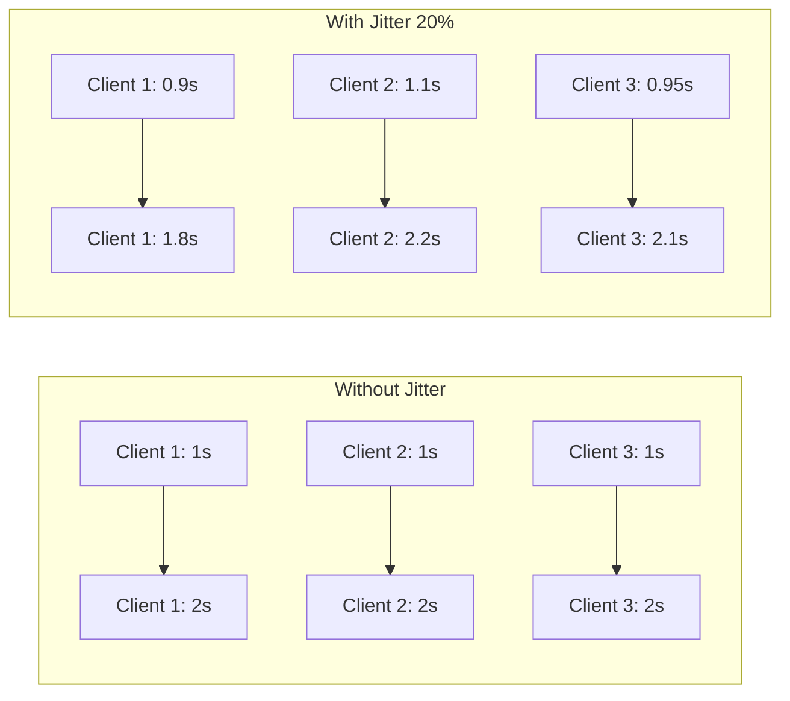
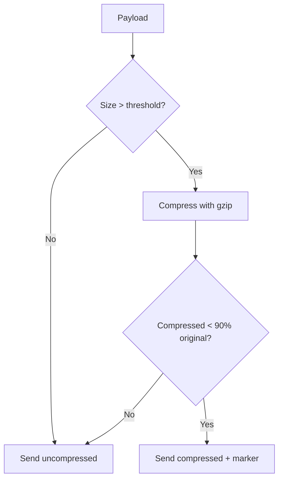
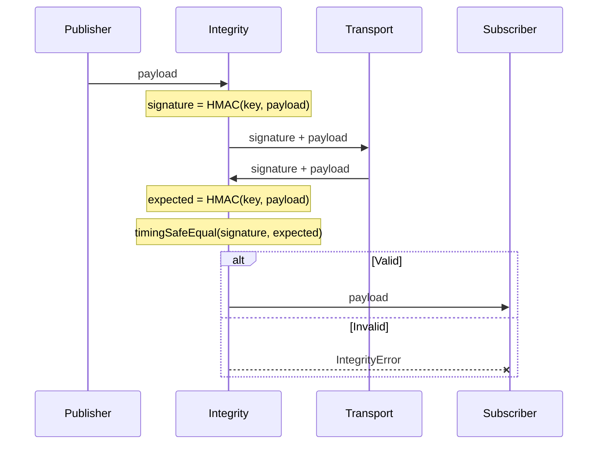
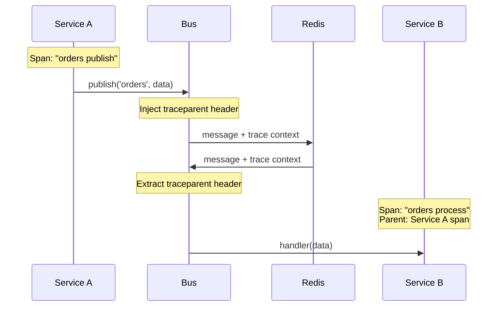
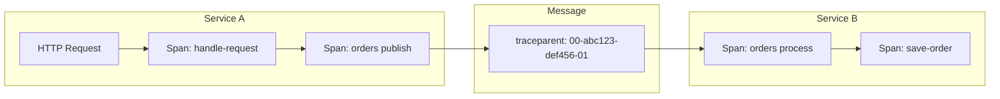
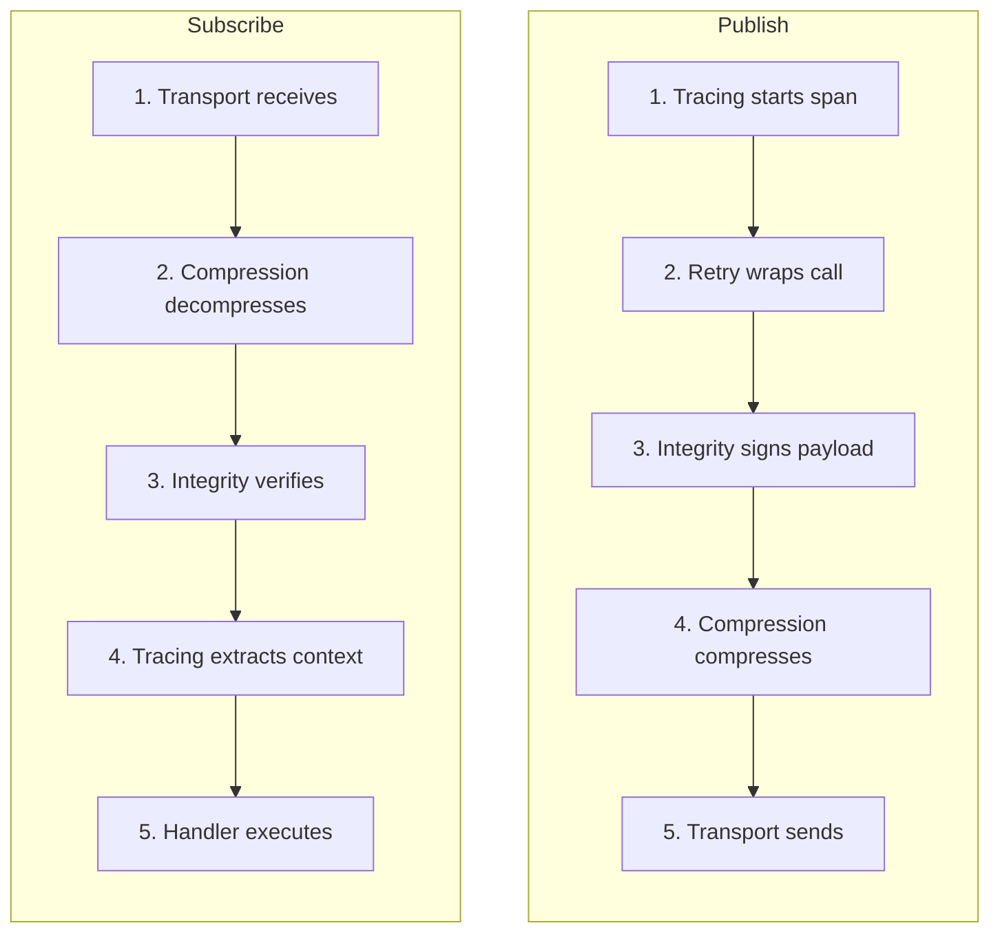

# Middleware

Middleware wraps the transport layer to add cross-cutting concerns without modifying business logic.

## Middleware Stack





Middleware is applied in this order for publish operations:

1. **Tracing** - Creates spans and injects trace context
2. **Retry** - Wraps transport calls with retry logic
3. **Integrity** - Signs payload with HMAC
4. **Compression** - Compresses payload if above threshold

For subscribe operations, the reverse happens: decompress, verify signature, then deliver to
handler.

## Retry

Automatically retry failed publish operations with configurable backoff strategies.

### Basic Configuration

```typescript
middleware: {
  retry: {
    maxAttempts: 5,
    delay: 1000,           // Base delay in ms
    backoff: 'exponential' // 'exponential' | 'linear' | 'fibonacci'
  }
}
```

### Shortcuts

```typescript
retry: true // 3 attempts, exponential backoff, 1000ms base delay
retry: 5 // 5 attempts, exponential backoff
retry: false // Disabled (default)
```

### Backoff Strategies

```mermaid
graph TD
    subgraph Exponential
        E1[Attempt 1: 1s]
        E2[Attempt 2: 2s]
        E3[Attempt 3: 4s]
        E4[Attempt 4: 8s]
        E1 --> E2 --> E3 --> E4
    end

    subgraph Linear
        L1[Attempt 1: 1s]
        L2[Attempt 2: 2s]
        L3[Attempt 3: 3s]
        L4[Attempt 4: 4s]
        L1 --> L2 --> L3 --> L4
    end

    subgraph Fibonacci
        F1[Attempt 1: 1s]
        F2[Attempt 2: 1s]
        F3[Attempt 3: 2s]
        F4[Attempt 4: 3s]
        F1 --> F2 --> F3 --> F4
    end
```



| Strategy    | Formula                | Use Case                        |
| ----------- | ---------------------- | ------------------------------- |
| Exponential | `delay * 2^attempt`    | Network failures, rate limiting |
| Linear      | `delay * attempt`      | Predictable load patterns       |
| Fibonacci   | `delay * fib(attempt)` | Balanced growth                 |

### Dead Letter Handling

When all retry attempts are exhausted, the message becomes a "dead letter":

```typescript
middleware: {
  retry: {
    maxAttempts: 3,
    onRetry: (channel, data, attempt) => {
      logger.warn('Retrying message', { channel, attempt })
    },
    onDeadLetter: (channel, data, error, attempts) => {
      logger.error('Message failed permanently', { channel, attempts })
      deadLetterQueue.push({ channel, data, error })
    }
  }
}
```



### Custom Backoff

Compose backoff strategies with utilities:

```typescript
import {
  exponentialBackoff,
  withJitter,
  withMaxDelay
} from '@lokiverse/bus'

// Exponential with 20% jitter and max 30s delay
const customBackoff = withMaxDelay(
  withJitter(exponentialBackoff, 0.2),
  30000
)

middleware: {
  retry: {
    maxAttempts: 10,
    backoff: customBackoff
  }
}
```

Jitter adds randomness to prevent thundering herd:



## Compression

Compress payloads above a threshold using gzip.

### Configuration

```typescript
middleware: {
  compression: {
    type: 'gzip',
    threshold: 5120  // Compress payloads > 5KB (default)
  }
}
```

### Compression Shortcuts

```typescript
compression: true // gzip, 5KB threshold
compression: false // Disabled (default)
```

### Compression Logic



The middleware only compresses when beneficial:

- Payload must exceed threshold
- Compressed size must be at least 10% smaller than original
- A marker byte (0x00 = uncompressed, 0x01 = gzip) is prepended

### Size Reduction Examples

| Payload Type          | Original | Compressed | Reduction    |
| --------------------- | -------- | ---------- | ------------ |
| JSON (repetitive)     | 15KB     | 3KB        | 80%          |
| JSON (unique strings) | 15KB     | 12KB       | 20%          |
| Binary data           | 15KB     | 14KB       | 7% (skipped) |

## Integrity

HMAC message authentication to detect tampering. Uses timing-safe comparison to prevent timing
attacks.

### Integrity Configuration

```typescript
middleware: {
  integrity: {
    type: 'hmac',
    key: process.env.HMAC_SECRET,
    algorithm: 'sha256'  // Default. Also: 'sha384', 'sha512'
  }
}
```

### Integrity Flow



### Message Format

```text
┌──────────────────┬─────────────────┐
│ HMAC Signature   │ Original Payload│
│ (32/48/64 bytes) │ (variable)      │
└──────────────────┴─────────────────┘
```

| Algorithm | Signature Size |
| --------- | -------------- |
| sha256    | 32 bytes       |
| sha384    | 48 bytes       |
| sha512    | 64 bytes       |

### Security Considerations

- **Timing-safe comparison**: Uses `crypto.timingSafeEqual()` to prevent timing attacks
- **Key management**: Store keys in environment variables or secret managers
- **Key rotation**: Change keys requires coordinated deployment (both publisher and subscriber)

```typescript
// Tampering detection
await manager.subscribe('secure-channel', (data) => {
  // This handler only runs if HMAC verification passes
  // IntegrityError thrown for tampered messages
})
```

## Tracing

OpenTelemetry distributed tracing with W3C TraceContext propagation.

### Tracing Configuration

```typescript
import { trace } from '@opentelemetry/api'

middleware: {
  tracing: {
    tracer: trace.getTracer('my-service'),
    recordPayloadSize: true  // Optional: record message size in span
  }
}
```

### Span Creation



The middleware creates two types of spans:

| Span Name           | Kind     | Description                       |
| ------------------- | -------- | --------------------------------- |
| `{channel} publish` | PRODUCER | Created when publishing a message |
| `{channel} process` | CONSUMER | Created when processing a message |

### Span Attributes

Following
[OpenTelemetry Semantic Conventions for Messaging](https://opentelemetry.io/docs/specs/semconv/messaging/):

| Attribute                     | Value                                       |
| ----------------------------- | ------------------------------------------- |
| `messaging.system`            | `redis` or `memory`                         |
| `messaging.destination.name`  | Channel name                                |
| `messaging.operation.type`    | `publish` or `process`                      |
| `messaging.message.body.size` | Payload size (if `recordPayloadSize: true`) |

### Trace Propagation



The trace context is embedded in the message using magic bytes (`0x54 0x52` = "TR") followed by a
JSON envelope containing W3C TraceContext headers.

## Full Example

Production-ready configuration with all middleware:

```typescript
import { BusManager, redis, withJitter, exponentialBackoff } from '@lokiverse/bus'
import { trace } from '@opentelemetry/api'

const manager = new BusManager({
  default: 'critical',
  transports: {
    critical: {
      transport: redis({
        url: process.env.REDIS_URL,
        socket: { reconnectStrategy: (retries) => Math.min(retries * 100, 5000) },
      }),
      codec: 'msgpack',
      middleware: {
        // Outermost: tracing captures full request lifecycle
        tracing: {
          tracer: trace.getTracer('order-service'),
          recordPayloadSize: true,
        },
        // Retry wraps everything below
        retry: {
          maxAttempts: 5,
          backoff: withJitter(exponentialBackoff, 0.2),
          onDeadLetter: (channel, data, error) => {
            deadLetterQueue.enqueue({ channel, data, error, timestamp: Date.now() })
          },
        },
        // Integrity before compression (sign uncompressed data)
        integrity: {
          type: 'hmac',
          key: process.env.HMAC_KEY,
          algorithm: 'sha256',
        },
        // Innermost: compression
        compression: {
          type: 'gzip',
          threshold: 1024,
        },
      },
    },
    // Simple transport for non-critical internal events
    internal: {
      transport: redis({ url: process.env.REDIS_URL }),
      codec: 'json', // Human-readable for debugging
    },
  },
})
```

## Middleware Execution Order

Understanding the order is important for debugging:


