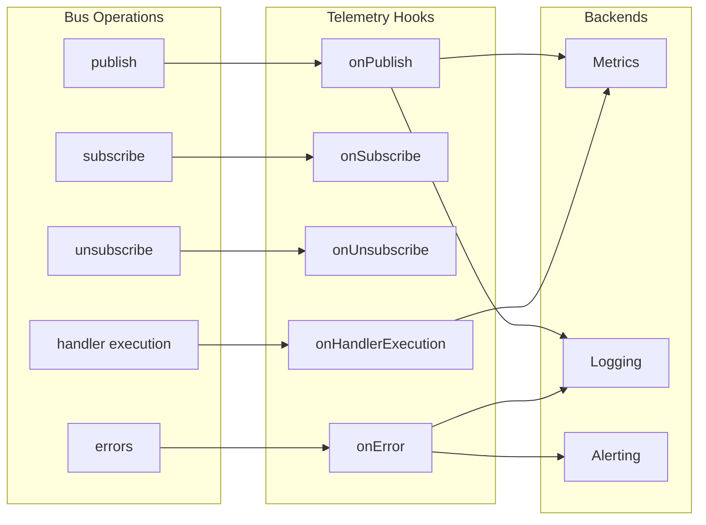
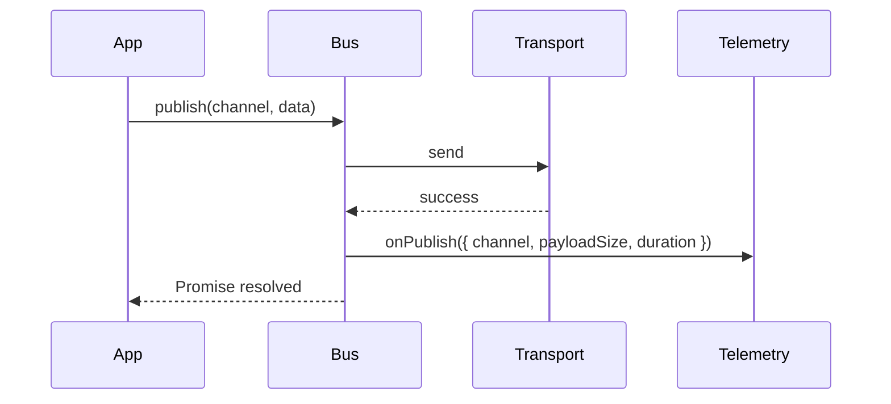
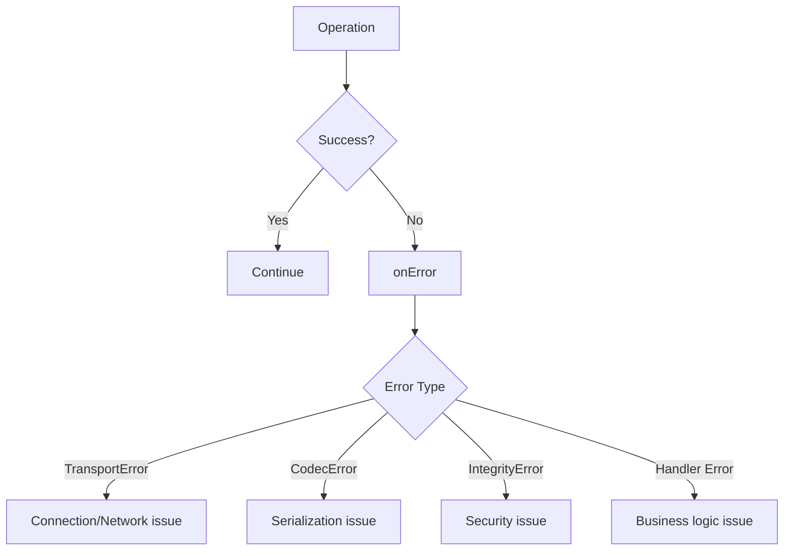
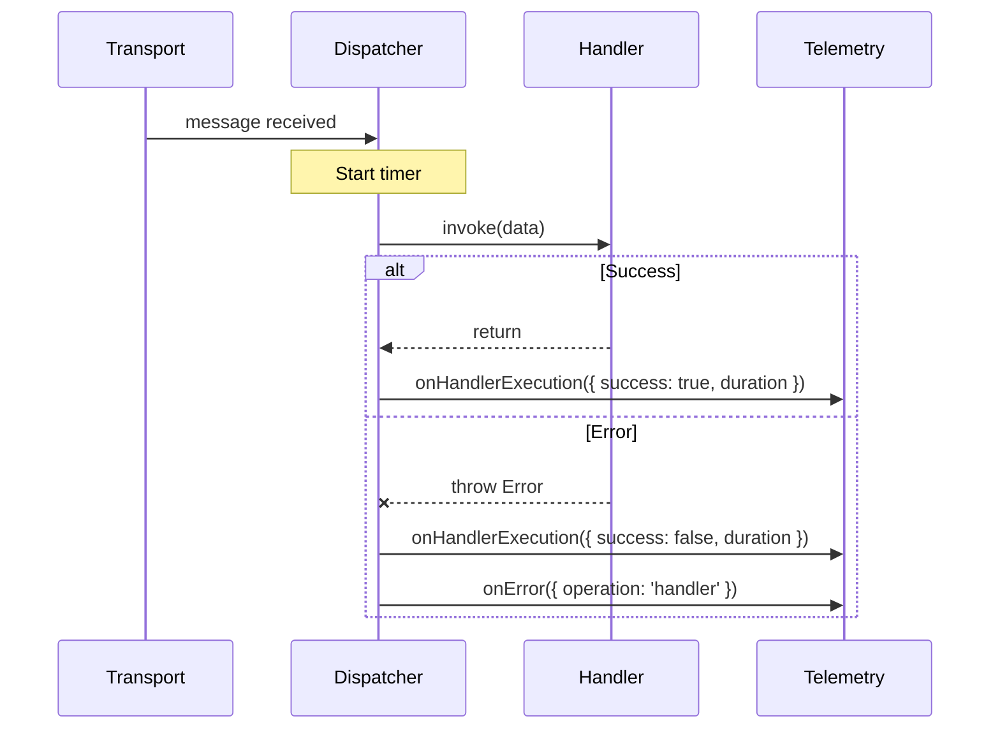
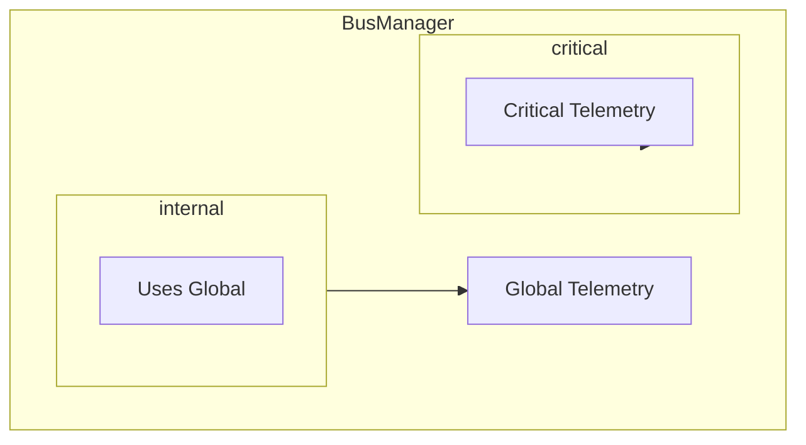
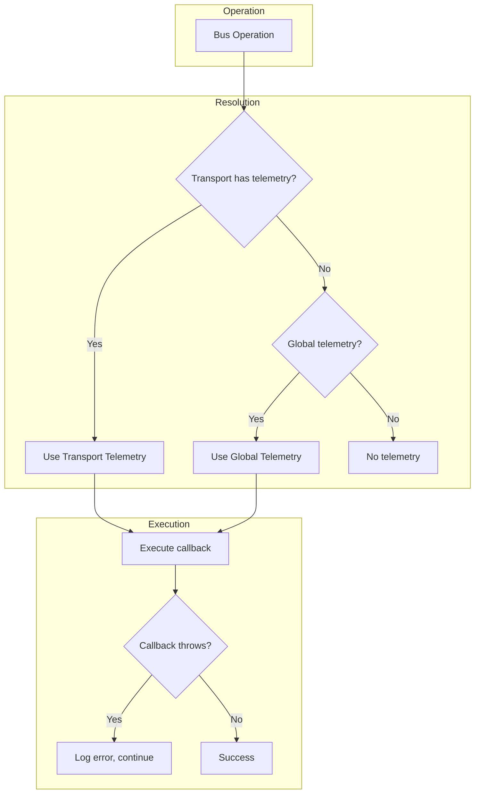

# Telemetry

Monitor bus operations with hooks for metrics, logging, and alerting.

## Overview



## Setup

```typescript
import { BusManager, type BusTelemetry } from '@lokiverse/bus'

const telemetry: BusTelemetry = {
  onPublish: ({ channel, payloadSize, duration }) => {
    console.log(`Published to ${channel}: ${payloadSize}B in ${duration?.toFixed(2)}ms`)
  },
  onSubscribe: ({ channel }) => {
    console.log(`Subscribed to ${channel}`)
  },
  onUnsubscribe: ({ channel }) => {
    console.log(`Unsubscribed from ${channel}`)
  },
  onError: ({ operation, channel, error }) => {
    console.error(`${operation} failed on ${channel}:`, error.message)
  },
  onHandlerExecution: ({ channel, duration, success }) => {
    console.log(`Handler ${channel}: ${success ? 'ok' : 'failed'} (${duration.toFixed(2)}ms)`)
  },
}

const manager = new BusManager({
  transports: { main: { transport: redis() } },
  telemetry,
})
```

## Events

### onPublish

Triggered after each successful publish operation.

```typescript
interface PublishEvent {
  channel: string
  payloadSize: number // Encoded size in bytes
  duration?: number // Operation duration in ms (if available)
}
```



### onSubscribe

Triggered when a new subscription is created.

```typescript
interface SubscribeEvent {
  channel: string
}
```

### onUnsubscribe

Triggered when a subscription is removed.

```typescript
interface UnsubscribeEvent {
  channel: string
}
```

### onError

Triggered on any operation failure.

```typescript
interface ErrorEvent {
  operation: 'publish' | 'subscribe' | 'unsubscribe' | 'handler'
  channel: string
  error: Error
}
```



### onHandlerExecution

Triggered after each handler execution (success or failure).

```typescript
interface HandlerExecutionEvent {
  channel: string
  duration: number // Handler execution time in ms
  success: boolean // Whether handler completed without throwing
}
```



## Prometheus Integration

Example integration with `prom-client`:

```typescript
import { Counter, Histogram, Gauge } from 'prom-client'

// Metrics
const messagesPublished = new Counter({
  name: 'bus_messages_published_total',
  help: 'Total messages published',
  labelNames: ['channel'],
})

const publishDuration = new Histogram({
  name: 'bus_publish_duration_seconds',
  help: 'Publish operation duration',
  labelNames: ['channel'],
  buckets: [0.001, 0.005, 0.01, 0.05, 0.1, 0.5, 1],
})

const payloadSize = new Histogram({
  name: 'bus_payload_size_bytes',
  help: 'Message payload size',
  labelNames: ['channel'],
  buckets: [100, 500, 1000, 5000, 10000, 50000, 100000],
})

const handlerDuration = new Histogram({
  name: 'bus_handler_duration_seconds',
  help: 'Handler execution duration',
  labelNames: ['channel', 'success'],
  buckets: [0.001, 0.01, 0.1, 0.5, 1, 5, 10],
})

const errors = new Counter({
  name: 'bus_errors_total',
  help: 'Total errors',
  labelNames: ['channel', 'operation', 'error_type'],
})

const activeSubscriptions = new Gauge({
  name: 'bus_active_subscriptions',
  help: 'Number of active subscriptions',
  labelNames: ['channel'],
})

// Telemetry configuration
const telemetry: BusTelemetry = {
  onPublish: ({ channel, payloadSize: size, duration }) => {
    messagesPublished.inc({ channel })
    payloadSize.observe({ channel }, size)
    if (duration) {
      publishDuration.observe({ channel }, duration / 1000)
    }
  },

  onSubscribe: ({ channel }) => {
    activeSubscriptions.inc({ channel })
  },

  onUnsubscribe: ({ channel }) => {
    activeSubscriptions.dec({ channel })
  },

  onHandlerExecution: ({ channel, duration, success }) => {
    handlerDuration.observe({ channel, success: String(success) }, duration / 1000)
  },

  onError: ({ operation, channel, error }) => {
    errors.inc({
      channel,
      operation,
      error_type: error.constructor.name,
    })
  },
}
```

### Grafana Dashboard Queries

```promql
# Messages per second by channel
rate(bus_messages_published_total[5m])

# 95th percentile publish latency
histogram_quantile(0.95, rate(bus_publish_duration_seconds_bucket[5m]))

# Error rate
rate(bus_errors_total[5m]) / rate(bus_messages_published_total[5m])

# Handler success rate
sum(rate(bus_handler_duration_seconds_count{success="true"}[5m])) /
sum(rate(bus_handler_duration_seconds_count[5m]))
```

## Per-Transport Telemetry

Override global telemetry for specific transports:



```typescript
const manager = new BusManager({
  transports: {
    critical: {
      transport: redis(),
      telemetry: {
        // Override: alert on any error
        onError: ({ error, channel }) => {
          alerting.page('oncall', `Critical bus error: ${channel}`, error)
        },
        // Override: detailed logging
        onPublish: ({ channel, payloadSize, duration }) => {
          logger.info('Critical message published', {
            channel,
            payloadSize,
            duration,
            timestamp: Date.now(),
          })
        },
      },
    },
    internal: {
      transport: memory(),
      // Uses global telemetry (no override)
    },
  },
  telemetry: globalTelemetry,
})
```

## Telemetry Flow



## Error Handling

Telemetry callbacks are non-blocking. Errors in callbacks are logged but don't affect bus
operations:

```typescript
const telemetry: BusTelemetry = {
  onPublish: () => {
    throw new Error('Metrics backend unavailable')
    // Error is caught and logged
    // Bus continues working normally
  },
}
```

This ensures observability failures don't impact application functionality.

## Structured Logging Example

```typescript
import pino from 'pino'

const logger = pino({ level: 'info' })

const telemetry: BusTelemetry = {
  onPublish: ({ channel, payloadSize, duration }) => {
    logger.info({
      event: 'bus.publish',
      channel,
      payloadSize,
      durationMs: duration,
    })
  },

  onSubscribe: ({ channel }) => {
    logger.info({ event: 'bus.subscribe', channel })
  },

  onUnsubscribe: ({ channel }) => {
    logger.info({ event: 'bus.unsubscribe', channel })
  },

  onError: ({ operation, channel, error }) => {
    logger.error({
      event: 'bus.error',
      operation,
      channel,
      error: {
        name: error.name,
        message: error.message,
        code: (error as any).code,
      },
    })
  },

  onHandlerExecution: ({ channel, duration, success }) => {
    const level = success ? 'info' : 'warn'
    logger[level]({
      event: 'bus.handler',
      channel,
      durationMs: duration,
      success,
    })
  },
}
```

## OpenTelemetry Integration

For distributed tracing, use the tracing middleware instead of (or in addition to) telemetry hooks:

```typescript
import { trace } from '@opentelemetry/api'

const manager = new BusManager({
  transports: {
    main: {
      transport: redis(),
      middleware: {
        // Distributed tracing with W3C TraceContext
        tracing: {
          tracer: trace.getTracer('my-service'),
          recordPayloadSize: true,
        },
      },
    },
  },
  // Telemetry for metrics (complementary to tracing)
  telemetry: {
    onPublish: ({ channel, duration }) => {
      metrics.recordPublish(channel, duration)
    },
  },
})
```

See [Middleware - Tracing](./middleware.md#tracing) for details on distributed tracing.
