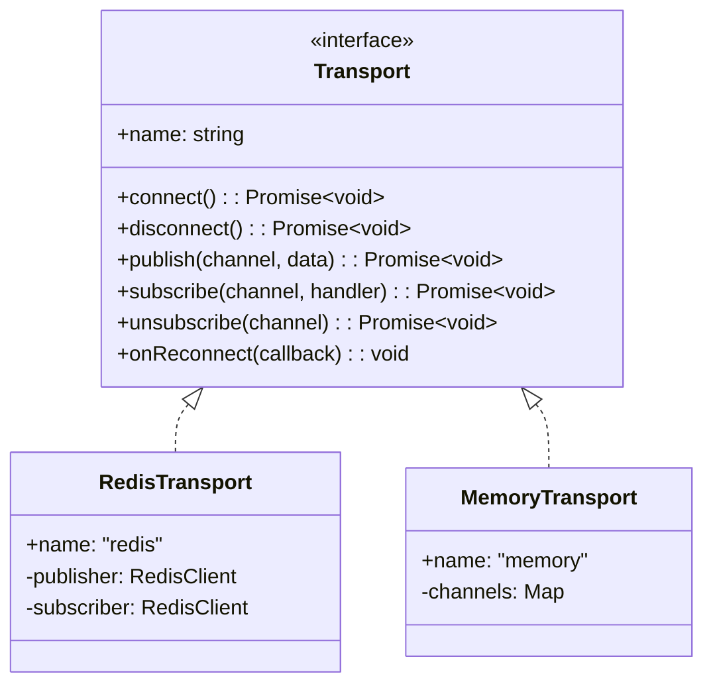
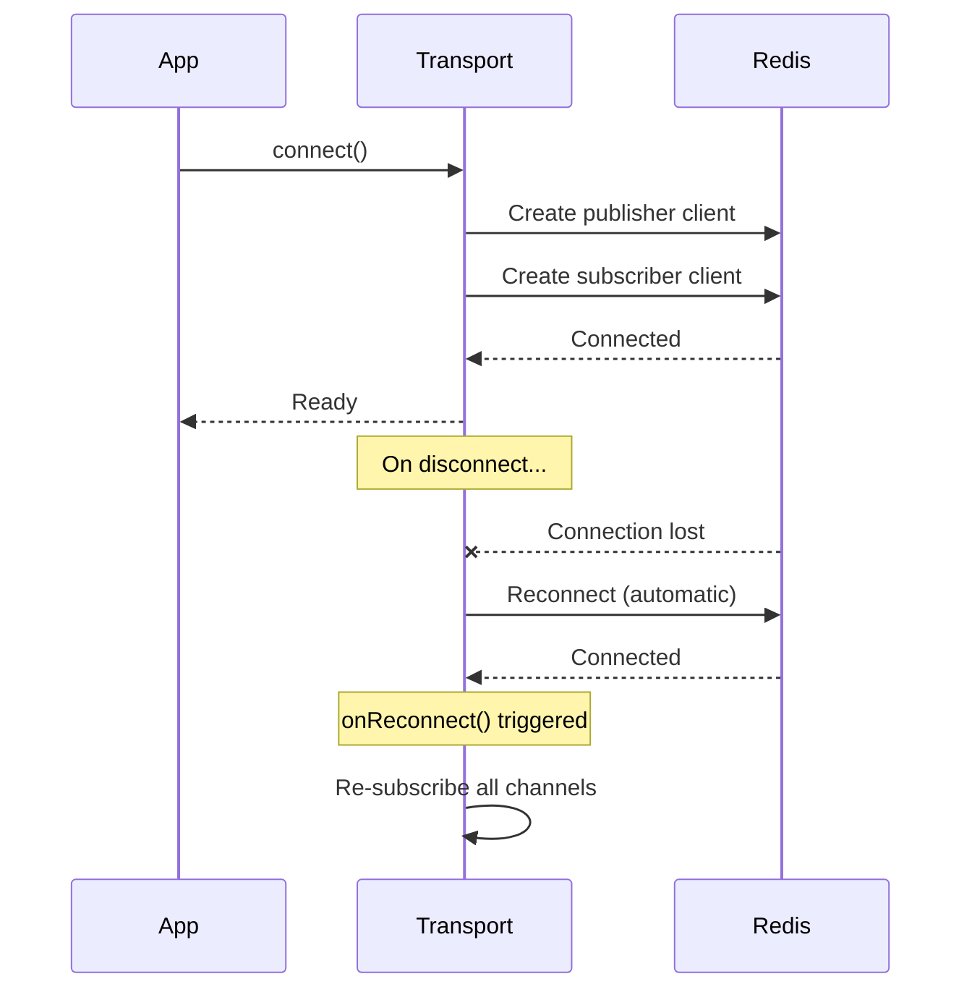
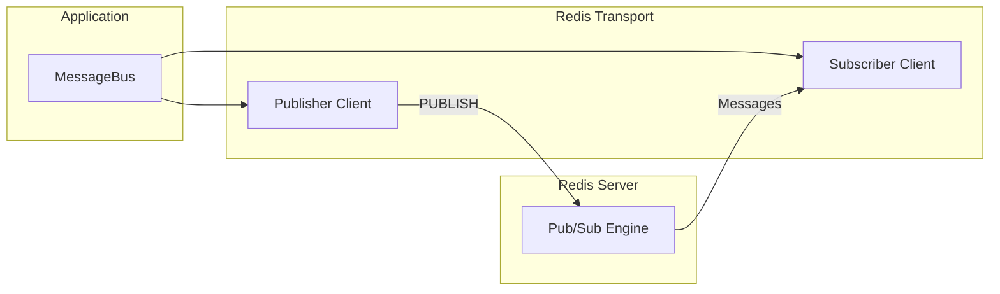
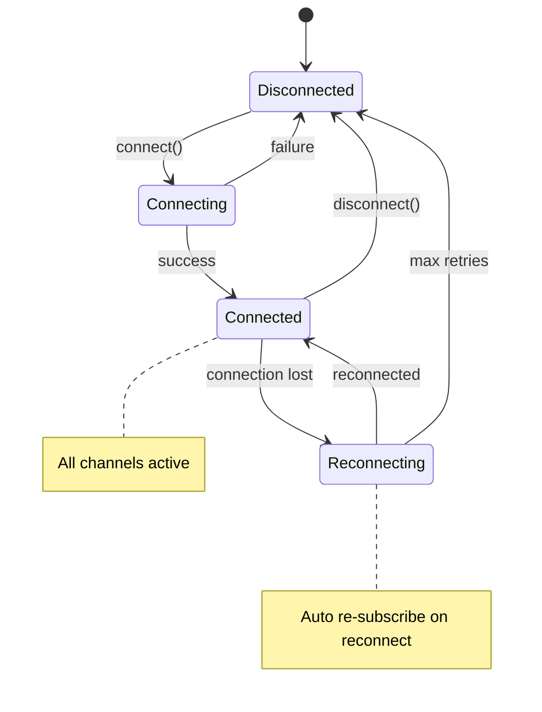
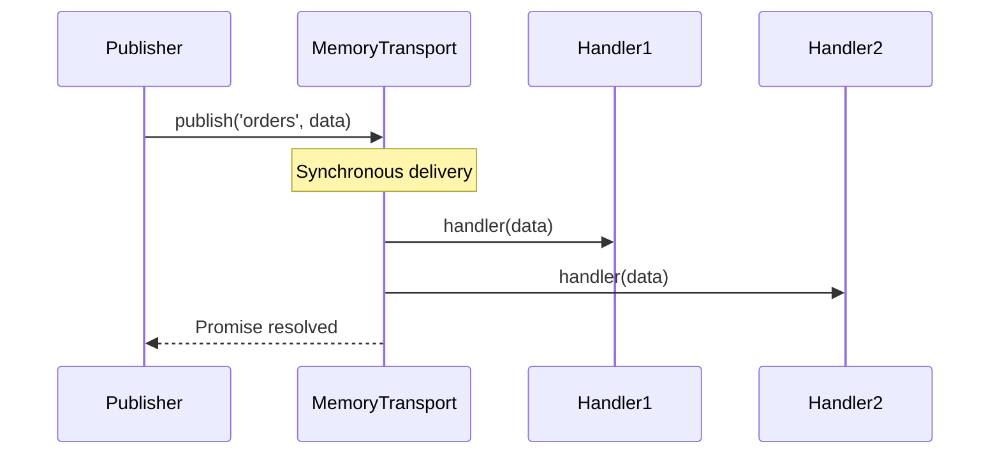
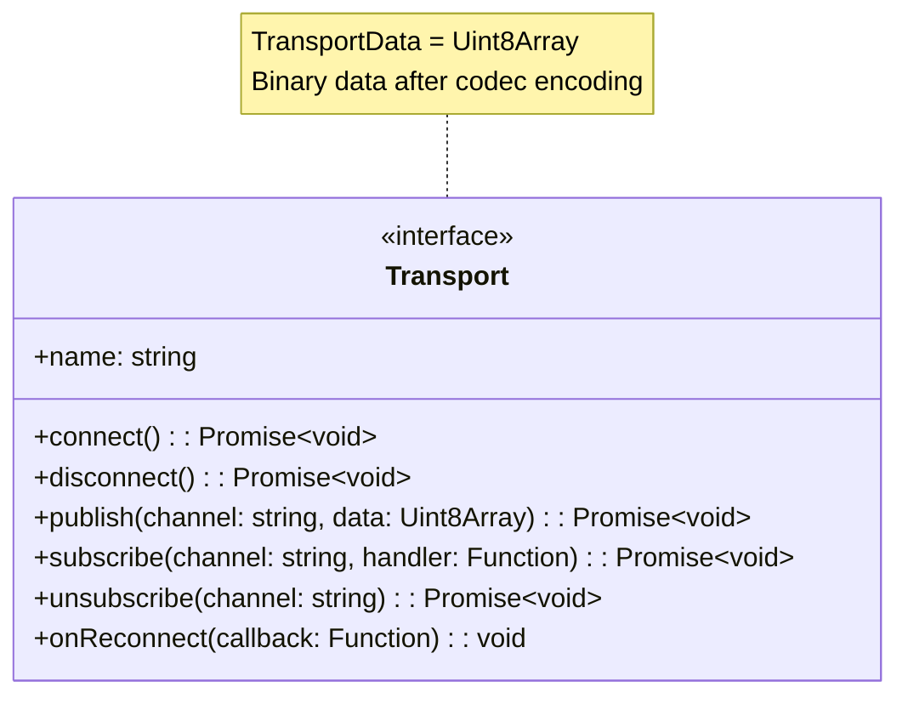
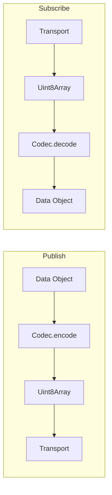
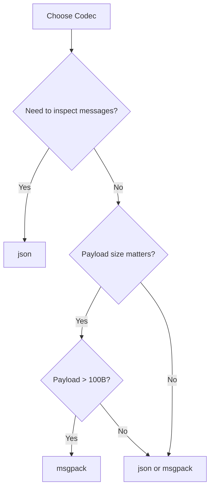
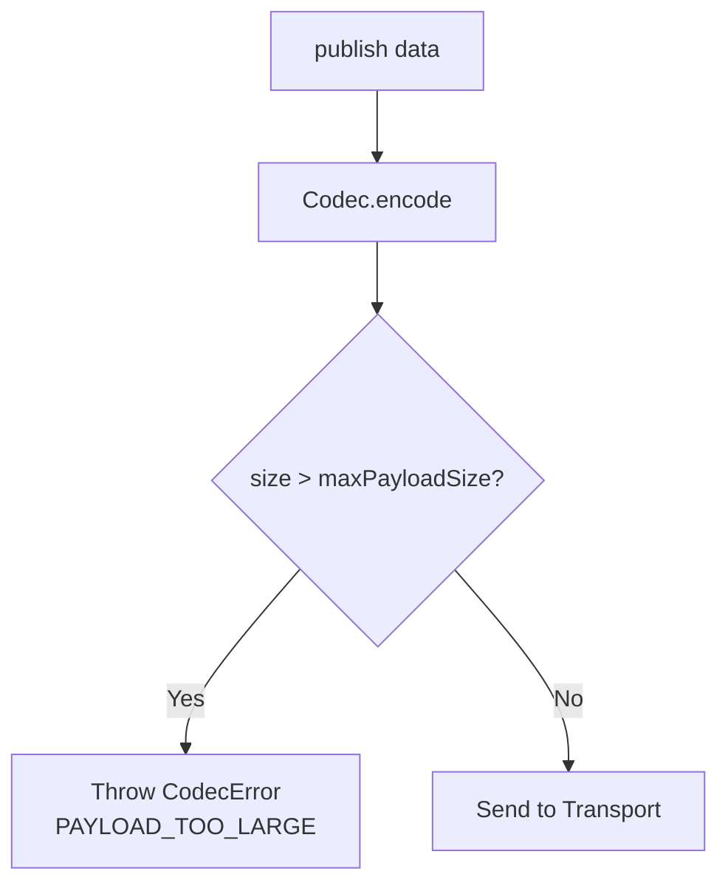

# Transports

Transports handle the actual message delivery. The library includes Redis and in-memory transports,
with support for custom implementations.

## Transport Architecture



## Redis Transport

Production transport using Redis Pub/Sub.

```typescript
import { redis } from '@lokiverse/bus'

const transport = redis({ url: 'redis://localhost:6379' })
```

### Standalone Mode

```typescript
redis({
  url: 'redis://localhost:6379',
  // or
  socket: {
    host: 'localhost',
    port: 6379,
  },
  password: 'secret',
  database: 0,
})
```

### Cluster Mode

```typescript
redis({
  rootNodes: [
    { host: 'node1', port: 7000 },
    { host: 'node2', port: 7001 },
    { host: 'node3', port: 7002 },
  ],
})
```

### Redis Connection Flow



### External Clients

Bring your own Redis clients for advanced configuration:

```typescript
import { createClient } from 'redis'

const publisher = createClient({
  url: 'redis://localhost:6379',
  socket: {
    reconnectStrategy: (retries) => Math.min(retries * 100, 5000),
  },
})
const subscriber = publisher.duplicate()

await publisher.connect()
await subscriber.connect()

redis({ publisher, subscriber })
```

### Why Two Clients?

Redis Pub/Sub requires separate connections for publishing and subscribing:



A Redis client in subscribe mode cannot execute other commands. The transport manages two
connections automatically.

### Reconnection Handling

The transport automatically handles reconnection and re-subscription:



When Redis reconnects after a disconnection:

1. Transport detects reconnection via client events
2. `onReconnect()` callback is triggered
3. MessageBus re-subscribes to all active channels
4. No messages are lost during re-subscription (new messages only)

## Memory Transport

In-process transport for testing and development.

```typescript
import { memory } from '@lokiverse/bus'

const transport = memory()
```

### Characteristics

| Aspect        | Behavior                     |
| ------------- | ---------------------------- |
| Delivery      | Synchronous, same event loop |
| Persistence   | None (in-memory only)        |
| Cross-process | No                           |
| Use case      | Unit tests, development      |

### Memory Transport Flow



Messages are delivered synchronously within the same process, making it ideal for testing:

```typescript
import { MessageBus, memory } from '@lokiverse/bus'

const bus = new MessageBus({ transport: memory() })

const received: Order[] = []
await bus.subscribe<Order>('orders', (order) => {
  received.push(order)
})

await bus.publish('orders', { id: 1, total: 99.99 })

// Immediately available (synchronous)
expect(received).toHaveLength(1)
expect(received[0].id).toBe(1)
```

## Custom Transport

Implement the `Transport` interface for custom backends (Kafka, RabbitMQ, etc.):

```typescript
import type { Transport, TransportData, TransportMessageHandler } from '@lokiverse/bus'

class KafkaTransport implements Transport {
  readonly name = 'kafka'

  private producer: KafkaProducer
  private consumer: KafkaConsumer
  private reconnectCallback?: () => void

  async connect(): Promise<void> {
    this.producer = await createProducer()
    this.consumer = await createConsumer()

    this.consumer.on('reconnect', () => {
      this.reconnectCallback?.()
    })
  }

  async disconnect(): Promise<void> {
    await this.producer.disconnect()
    await this.consumer.disconnect()
  }

  async publish(channel: string, data: TransportData): Promise<void> {
    await this.producer.send({
      topic: channel,
      messages: [{ value: Buffer.from(data) }],
    })
  }

  async subscribe(channel: string, handler: TransportMessageHandler): Promise<void> {
    await this.consumer.subscribe({ topic: channel })
    this.consumer.on('message', (message) => {
      if (message.topic === channel) {
        handler(new Uint8Array(message.value))
      }
    })
  }

  async unsubscribe(channel: string): Promise<void> {
    await this.consumer.unsubscribe({ topic: channel })
  }

  onReconnect(callback: () => void): void {
    this.reconnectCallback = callback
  }
}
```

### Transport Interface



| Method          | Purpose                                   |
| --------------- | ----------------------------------------- |
| `connect()`     | Establish connection to backend           |
| `disconnect()`  | Close connection gracefully               |
| `publish()`     | Send binary data to channel               |
| `subscribe()`   | Register handler for channel              |
| `unsubscribe()` | Remove all handlers for channel           |
| `onReconnect()` | Register callback for reconnection events |

## Codecs

Codecs serialize/deserialize messages before transport.



### Built-in Codecs

```typescript
codec: 'json' // Human-readable, good for debugging
codec: 'msgpack' // Binary, 17-47% smaller than JSON (default)
codec: 'base64' // Text-safe encoding
```

| Codec   | Format | Size           | Speed | Use Case                    |
| ------- | ------ | -------------- | ----- | --------------------------- |
| json    | Text   | Baseline       | Fast  | Debugging, human inspection |
| msgpack | Binary | 17-47% smaller | Fast  | Production (default)        |
| base64  | Text   | 33% larger     | Fast  | Text-only transports        |

### Codec Selection Guide



### Custom Codec

```typescript
import type { Codec } from '@lokiverse/bus'

const customCodec: Codec = {
  encode: (data) => {
    const json = JSON.stringify(data)
    return new Uint8Array(Buffer.from(json))
  },
  decode: (bytes) => {
    const json = Buffer.from(bytes).toString()
    return JSON.parse(json)
  },
}

const bus = new MessageBus({
  transport: redis(),
  codec: customCodec,
})
```

## Payload Size Limits

Protect against oversized payloads that could cause memory issues:

```typescript
const manager = new BusManager({
  transports: {
    api: {
      transport: redis(),
      maxPayloadSize: 1024 * 1024, // 1MB limit
    },
    internal: {
      transport: redis(),
      maxPayloadSize: 10 * 1024 * 1024, // 10MB (default)
    },
    unlimited: {
      transport: memory(),
      maxPayloadSize: undefined, // No limit
    },
  },
})
```

### Size Validation Flow



| Setting          | Default | Description                  |
| ---------------- | ------- | ---------------------------- |
| `maxPayloadSize` | 10MB    | Maximum encoded payload size |
| `undefined`      | -       | Disable size validation      |

Oversized payloads throw `CodecError` with code `PAYLOAD_TOO_LARGE`:

```typescript
try {
  await bus.publish('large-data', hugeObject)
} catch (error) {
  if (error instanceof CodecError && error.code === 'PAYLOAD_TOO_LARGE') {
    console.error(`Payload too large: ${error.message}`)
  }
}
```
